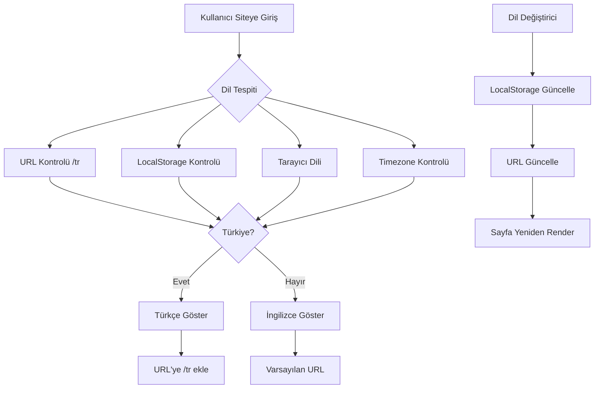

# VeeqAI Webpage Architecture - Çok Dilli Destek

## 🏗️ Proje Mimarisi

```
webpage/
├── src/
│   ├── i18n/                    # Çok dilli destek
│   │   ├── index.ts             # i18n yapılandırması
│   │   └── locales/             # Dil dosyaları
│   │       ├── en.json          # İngilizce çeviriler
│   │       └── tr.json          # Türkçe çeviriler
│   │
│   ├── components/              # React bileşenleri
│   │   ├── Header.tsx           # Navigasyon başlığı (i18n destekli)
│   │   ├── Footer.tsx           # Alt bilgi
│   │   ├── LanguageSwitcher.tsx # Dil değiştirme bileşeni
│   │   └── ...                  # Diğer bileşenler
│   │
│   ├── pages/                   # Sayfa bileşenleri
│   │   ├── Landing.tsx          # Ana sayfa
│   │   ├── Features.tsx         # Özellikler
│   │   ├── Pricing.tsx          # Fiyatlandırma
│   │   ├── About.tsx            # Hakkımızda
│   │   ├── Contact.tsx          # İletişim
│   │   ├── MusicGenerator.tsx   # Müzik üretici
│   │   ├── TextToSpeech.tsx     # Metinden sese
│   │   ├── VoiceCloning.tsx     # Ses klonlama
│   │   ├── VoiceDesign.tsx      # Ses tasarımı
│   │   ├── VoiceIsolator.tsx    # Ses izolatörü
│   │   ├── PrivacyPolicy.tsx    # Gizlilik politikası
│   │   ├── TermsOfService.tsx   # Kullanım koşulları
│   │   ├── CookiePolicy.tsx     # Çerez politikası
│   │   └── docs/                # Dokümantasyon sayfaları
│   │       ├── Introduction.tsx
│   │       ├── Authentication.tsx
│   │       ├── QuickStart.tsx
│   │       └── ...
│   │
│   ├── sections/                # Sayfa bölümleri
│   │   ├── Hero.tsx
│   │   ├── Features.tsx
│   │   ├── Pricing.tsx
│   │   └── Demo.tsx
│   │
│   ├── App.tsx                  # Ana uygulama (routing)
│   ├── main.tsx                 # Giriş noktası
│   └── index.css                # Global stiller
│
├── public/                      # Statik dosyalar
├── package.json                 # Bağımlılıklar
└── vite.config.ts              # Vite yapılandırması
```

## 🌍 Çok Dilli Destek Özellikleri

### 1. **Otomatik Dil Tespiti**
- 🌐 **Coğrafi Konum**: Türkiye'den girildiğinde otomatik Türkçe
- 🔍 **Tarayıcı Dili**: Navigator.language kontrolü
- ⏰ **Timezone**: Europe/Istanbul kontrolü
- 💾 **LocalStorage**: Kullanıcı tercihi kaydetme

### 2. **URL Yapısı**
```
İngilizce (Varsayılan):
- http://localhost:5175/
- http://localhost:5175/features
- http://localhost:5175/pricing

Türkçe:
- http://localhost:5175/tr
- http://localhost:5175/tr/features
- http://localhost:5175/tr/pricing
```

### 3. **Routing Yapısı**
```typescript
// Türkçe rotalar
<Route path="/tr" element={<Landing />} />
<Route path="/tr/features" element={<FeaturesPage />} />
<Route path="/tr/pricing" element={<PricingPage />} />

// İngilizce rotalar (varsayılan)
<Route path="/" element={<Landing />} />
<Route path="/features" element={<FeaturesPage />} />
<Route path="/pricing" element={<PricingPage />} />
```

## 🛠️ Teknoloji Stack

### Frontend Framework
- **React 18.2**: UI framework
- **TypeScript 5.0**: Type safety
- **Vite 4.3**: Build tool

### Routing & Navigation
- **React Router DOM 6.8**: SPA routing
- **/tr prefix**: Türkçe sayfa yönlendirmeleri

### Internationalization (i18n)
- **i18next 25.3**: Çeviri yönetimi
- **react-i18next 15.6**: React entegrasyonu
- **i18next-browser-languagedetector 8.2**: Otomatik dil tespiti

### Styling
- **Tailwind CSS 3.2**: Utility-first CSS
- **PostCSS**: CSS processing
- **Autoprefixer**: Browser uyumluluğu

### UI Components
- **Lucide React**: İkon kütüphanesi
- **clsx**: Dinamik class yönetimi

### Diğer
- **Socket.io Client**: Real-time iletişim
- **WaveSurfer.js**: Ses dalga görselleştirme

## 📋 Sayfa Listesi

### Ana Sayfalar
1. **Landing** - Ana sayfa
2. **Features** - Özellikler
3. **Pricing** - Fiyatlandırma
4. **About** - Hakkımızda
5. **Contact** - İletişim

### Ürün Sayfaları
1. **Music Generator** - Müzik üretici
2. **Text to Speech** - Metinden sese
3. **Voice Cloning** - Ses klonlama
4. **Voice Design** - Ses tasarımı
5. **Voice Isolator** - Ses izolatörü

### Dokümantasyon (15 sayfa)
- Introduction
- Authentication
- Quick Start
- API Explorer
- Endpoints
- SDK Generator
- Postman Collection
- OpenAPI Spec
- Error Handling
- Rate Limits
- Help
- Payment Methods
- Stripe Integration
- Iyzico Integration
- Billing Management

### Yasal Sayfalar
1. **Privacy Policy** - Gizlilik politikası
2. **Terms of Service** - Kullanım koşulları
3. **Cookie Policy** - Çerez politikası

## 🔄 Dil Değiştirme Akışı



## 🎯 Özellikler

### ✅ Tamamlanan
- ✓ i18n kütüphanesi kurulumu
- ✓ Türkçe/İngilizce dil dosyaları
- ✓ Otomatik dil tespiti
- ✓ URL bazlı routing (/tr prefix)
- ✓ Dil değiştirme komponenti
- ✓ LocalStorage entegrasyonu
- ✓ Header komponenti i18n desteği
- ✓ Tüm sayfalar için route tanımları

### 📝 Yapılacaklar
- [ ] Tüm sayfalarda çeviri entegrasyonu
- [ ] Footer komponenti i18n desteği
- [ ] Form validasyon mesajları çevirisi
- [ ] API hata mesajları çevirisi
- [ ] Meta tag ve SEO optimizasyonu
- [ ] Dil bazlı içerik yönetimi

## 🚀 Kullanım

### Geliştirme Ortamı
```bash
cd webpage
npm install
npm run dev
```

### Production Build
```bash
npm run build
npm run preview
```

### Dil Değiştirme
1. Header'daki dil değiştirici ile
2. URL'ye manuel /tr ekleme ile
3. Tarayıcı dili otomatik tespiti ile

## 📦 Paket Boyutları

- **Toplam Dependencies**: 10 paket
- **Toplam DevDependencies**: 8 paket
- **i18n Paketleri**: ~200KB (gzipped)
- **Build Size**: ~500KB (production)

## 🔐 Güvenlik

- XSS koruması: React varsayılan escape
- Çeviri anahtarları güvenli
- LocalStorage şifreleme yok (sadece dil tercihi)
- HTTPS zorunlu (production)

## 📈 Performans

- Lazy loading ile sayfa yüklemeleri
- Çeviri dosyaları önbelleğe alınır
- LocalStorage ile hızlı dil değişimi
- Minimal re-render ile performans optimizasyonu

## 🤝 Entegrasyonlar

- Backend API: http://localhost:5000
- Frontend App: http://localhost:5173
- Admin Panel: http://localhost:5174
- Documentation: http://localhost:5175/docs